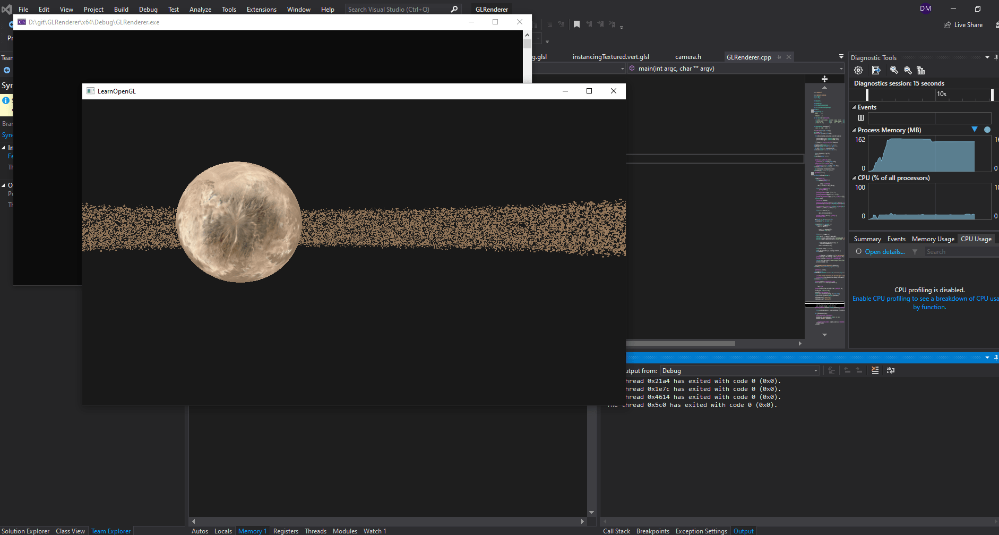

# GLRenderer
Personal project to learn OpenGL through LearnOpenGL website and specifically graphics algorithms and techniques.
The purpose of this project is not to be read by anyone, but rather for myself to learn and continue the project in whatever PC I have at the moment. Code should be organised, but it's not right now.

**Instanced rendering of asteroids rotating around a planet.**
